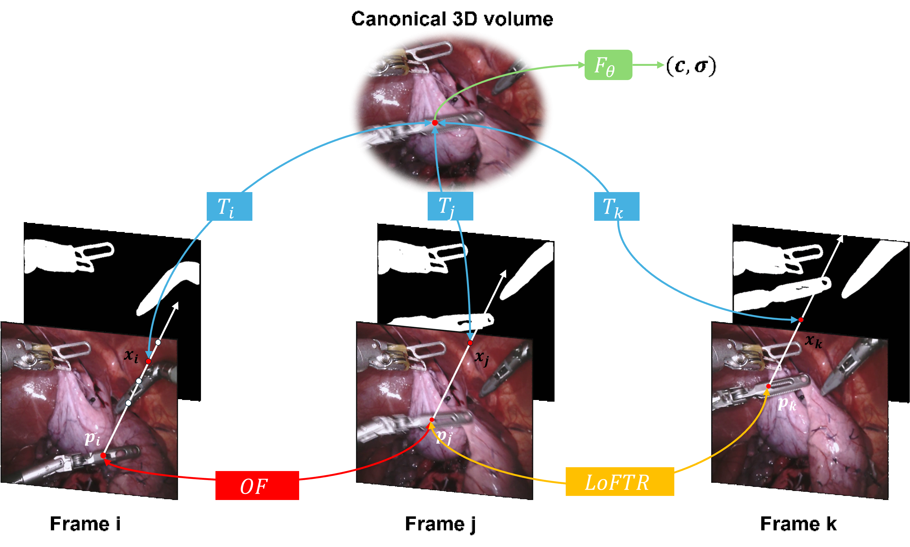

<p align="center">

  <h1 align="center">Tracking Everything in Robotic-Assisted Surgery</h1>
  <div align="center">
    <h4><strong>Bohan Zhan, Wang Zhao, Yi Fang, Bo Du, Francisco Vasconcelos, Danail Stoyanov, Daniel S. Elson, Baoru Huang*</strong></h4>
    <h3 align="center"> || <a href="https://arxiv.org/abs/2409.19821">Paper</a> || </h3>
    <div align="center"></div>
  </div>
  <div align="center"></div>
</p>
<p align="center">
    
  </a>
</p>


## Installation
The code is tested with `python=3.8` and `torch=1.10.0+cu111`

```
git clone --recurse-submodules https://github.com/zhanbh1019/SurgicalMotion.git
cd SurgicalMotion/
conda create -n surgicalmotion python=3.8
conda activate surgicalmotion
pip install torch==1.10.0+cu111 torchvision==0.11.0+cu111 torchaudio==0.10.0 -f https://download.pytorch.org/whl/torch_stable.html
pip install matplotlib tensorboard scipy opencv-python tqdm tensorboardX configargparse ipdb kornia imageio[ffmpeg]
```

## Dataset
We provide our [data](https://drive.google.com/file/d/1jB-i2r0o9RZWTEh_sVQkSGoKL0YozrsL/view?usp=drive_link), including image, mask and annotation.
The data structure is as follows:
```
├──data
    ├──sequence_name/
        ├──color/
            ├──00000.jpg
            ├──00001.jpg
            .....
        ├──mask/ 
            ├──00000.png
            ├──00001.png
            .....
├──Anotation
    ├──sequence_name.pkl
```

## Training
1. Please refer to the [preprocessing instructions](preprocessing/README.md) for preparing input data for training SurgicalMotion. 
2. With processed input data, run the following command to start training:
    ```
    python train.py --config configs/default.txt --data_dir {sequence_directory}
    ```
    You can view visualizations on tensorboard by running `tensorboard --logdir logs/`. 


## Evaluation
    ```
    python evaluation.py --config configs/default.txt --data_dir {sequence_directory}
    ```

## Acknowledgements
Our work based on [OmniMotion](https://github.com/qianqianwang68/omnimotion). We appreciate the authors of relevant repository and paper.

## Citation
```
@article{zhan2024tracking,
  title={Tracking Everything in Robotic-Assisted Surgery},
  author={Zhan, Bohan and Zhao, Wang and Fang, Yi and Du, Bo and Vasconcelos, Francisco and Stoyanov, Danail and Elson, Daniel S and Huang, Baoru},
  journal={arXiv preprint arXiv:2409.19821},
  year={2024}
}

```
